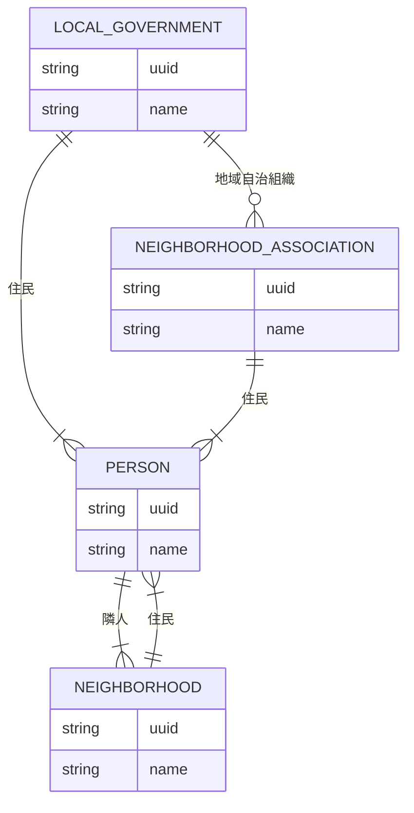

住民を起点としてモデリングを進める

# 自然人
- entityName: person

# 隣人
- entityName: neighborhood

# 地方公共団体
- entityName: local_government

# 地域自治組織
- entityName: neighborhood_association

# ER図

```mermaid
erDiagram
    LOCAL_GOVERNMENT ||--|{ PERSON: "住民"
    LOCAL_GOVERNMENT ||--o{ NEIGHBORHOOD_ASSOCIATION: "地域自治組織"
    NEIGHBORHOOD_ASSOCIATION ||--|{ PERSON: "住民"
    PERSON ||--|{ NEIGHBORHOOD: "隣人"
    NEIGHBORHOOD ||--|{ PERSON: "住民"
    PERSON {
      string uuid
      string name
    }
    NEIGHBORHOOD {
      string uuid
      string name 
    }
    LOCAL_GOVERNMENT {
      string uuid
      string name
    }
    NEIGHBORHOOD_ASSOCIATION {
      string uuid
      string name
    }
```